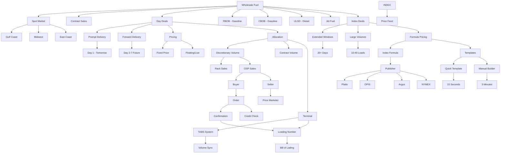

# OSP Terminology & Concept Graph - UPDATED
*September 2025 - Post-Kickoff Integration*
*Covers Fixed-Price Day Deals + Index-Based Extended Deals + Template Workflows*

## CONCEPT RELATIONSHIP MAP



## TERMINOLOGY DEFINITIONS & RELATIONSHIPS

### FUEL TRADING TERMINOLOGY

| Term | Definition | Related To | Business Impact |
|------|------------|------------|-----------------|
| **Day Deal** | Short-term fuel purchase (1-3 days) | Spot Market, OSP, Quick delivery | Alternative to rack pricing, better margins |
| **Rack** | Public wholesale fuel pricing point | Terminal, Fixed pricing, 24-hour | Traditional sales channel, commodity pricing |
| **Spot Market** | Regional fuel trading hub | Price discovery, Volatility | 7 major US markets, daily price changes |
| **Prompt** | Next-day delivery product | Day 1, Immediate needs | Most liquid, highest volume |
| **Forward** | Future delivery (2-7 days) | Planning, Price hedging | Less liquid, planning advantage |
| **Instrument** | Pricing/delivery timing unit | Prompt/Forward classification | Determines price calculation method |

### VOLUME & ALLOCATION TERMINOLOGY

| Term | Definition | Related To | Business Impact |
|------|------------|------------|-----------------|
| **Allocation** | Volume limit at terminal | TABS, Physical inventory | Prevents overselling, ensures availability |
| **Discretionary** | Non-contracted flexible volume | Rack + OSP sharing | ~40% of total volume, higher margins |
| **Rate-able** | Steady volume drawdown | Seller preference, Planning | Predictable depletion, easier management |
| **Channel Split** | Division between rack/OSP | Revenue optimization | Typically 60/40 rack/OSP |
| **Depletion** | Volume consumption rate | Monitoring, Adjustments | Triggers reallocation decisions |
| **TABS Group** | Terminal allocation identifier | DTN system, Integration | Links OSP to physical inventory |

### PRICING TERMINOLOGY

| Term | Definition | Related To | Business Impact |
|------|------------|------------|-----------------|
| **Basis** | Differential pricing (+/-) | Spread over index | +0.0325 means 3.25 cents premium |
| **Index** | Base market price reference | Platts, OPIS, Argus | Foundation for all pricing |
| **Spread** | Premium/discount to index | Profit margin, Competition | Key profitability driver |
| **Live/Floating** | Real-time price updates | Market volatility, Risk | Updates every 30 seconds |
| **Fixed** | Locked price at submission | Price certainty, Risk mgmt | No changes after order |
| **Formula** | Pricing calculation rules | Automation, Consistency | Index + modifiers = price |

### **NEW** INDEX PRICING TERMINOLOGY

| Term | Definition | Related To | Business Impact |
|------|------------|------------|-----------------|
| **Index Deal** | Extended delivery contracts with formula pricing | 20+ day windows, Large volumes | Access to contract-like volumes |
| **Formula** | Mathematical price calculation (e.g., "Platts + 0.05") | Publisher + Instrument + Differential | Automated pricing at lifting |
| **Template** | Pre-built formula for common use cases | 15-second creation, Business friendly | 92% time reduction in formula building |
| **Publisher** | Market data provider | Platts, OPIS, Argus, NYMEX | Source of index prices |
| **Instrument** | Specific price index | RBOB_Prompt, Diesel_NYH, etc. | What commodity/market to reference |
| **Date Rule** | When to fetch price | prior_day, prompt_month, etc. | Timing of price determination |
| **Differential** | Fixed spread added to formula | Usually ±$0.01 to ±$0.10 | Seller's margin over index |
| **Soft Hold** | Volume reservation for index deals | Not decremented until lifting | Flexible inventory management |
| **Hard Decrement** | Immediate volume commitment (fixed deals) | Volume removed at order time | Traditional inventory allocation |
| **Lifting Time** | When buyer physically picks up fuel | Triggers final price calculation | Critical timing for index pricing |
| **Terms Acceptance** | Buyer's explicit agreement to index pricing | Legal requirement for index orders | Risk acknowledgment and consent |
| **Formula Snapshot** | Frozen formula state at order time | Prevents retroactive changes | Price calculation integrity |
| **Market Data Fallback** | Backup pricing when primary unavailable | Prior day, alternative source | Ensures calculation continuity |
| **Calculation Engine** | Real-time formula processing system | Index fetching, Math operations | Core index pricing infrastructure |
| **Template Library** | Searchable collection of formula templates | Pre-validated, Usage statistics | Efficiency and standardization |

### **NEW** TEMPLATE SYSTEM TERMINOLOGY

| Term | Definition | Related To | Business Impact |
|------|------------|------------|-----------------|
| **Quick Template** | 15-second formula creation mode | Template selection + minor customization | 92% time savings vs manual |
| **Manual Builder** | 3-minute custom formula creation | Full flexibility for complex formulas | Expert mode for unique requirements |
| **Template Preview** | Sample calculation display | Example pricing scenarios | User understanding before selection |
| **Component Weight** | Percentage of each index in formula | Must sum to 100% | Formula composition validation |
| **Business Display** | Human-readable formula description | "90% Platts RBOB + 10% Ethanol + 3.25¢" | Business user comprehension |
| **System Formula** | Technical calculation string | (0.9×PLATTS_GC_RBOB) + (0.1×PLATTS_CHI_ETH) + 0.0325 | System processing format |
| **Template Usage Stats** | Frequency and recency metrics | "Used 47 times, Last: Yesterday" | Template popularity and relevance |
| **Progressive Disclosure** | Gradual complexity revelation | Simple → Advanced options | UX principle for hybrid approach |

### **NEW** CUSTOMER FEEDBACK TERMINOLOGY

| Term | Definition | Related To | Business Impact |
|------|------------|------------|-----------------|
| **Business User Friendly** | Non-technical language and interface | Customer feedback: Jake/Sinclair, Mandy/Motiva | Adoption and usability improvement |
| **Developer-Focused** | Technical implementation details | What to avoid in business UX | Barrier to business user adoption |
| **92% Time Reduction** | Template efficiency metric | 15 seconds vs 3+ minutes manual | Validated customer time savings |
| **Hybrid Approach** | Template-first with manual fallback | 80% template, 20% manual usage | Balance simplicity with flexibility |
| **Template-First Design** | Default to templates, offer manual | Strategic UX direction | Optimize for majority use case |

### DUAL PRICING PARADIGM TERMINOLOGY

| Term | Definition | Related To | Business Impact |
|------|------------|------------|-----------------|
| **Fixed-Price Deals** | Traditional day deals with locked pricing | 1-3 days, 1-2 loads, immediate pricing | Current market (~5% of fuel transactions) |
| **Index-Based Deals** | Extended deals with formula pricing | 20+ days, 10-40 loads, lifting-time pricing | Target market (~20% expansion opportunity) |
| **Mixed Marketplace** | Combined fixed and index deal display | Unified UX for both paradigms | Seamless user experience |
| **Dual Risk Model** | Different risk allocation by deal type | Fixed: seller risk, Index: shared risk | Flexible risk management options |
| **Volume Paradigm Shift** | Small vs large volume capabilities | Fixed: 1-2 loads, Index: 10-40 loads | Market expansion opportunity |
| **Pricing Time Separation** | When price is determined | Fixed: order time, Index: lifting time | Different timing and risk profiles |

### TERMINAL & LOGISTICS TERMINOLOGY

| Term | Definition | Related To | Business Impact |
|------|------------|------------|-----------------|
| **Loading Number** | Terminal pickup authorization | BOL, Physical delivery | 9-digit code like 9100362 |
| **Terminal** | Physical fuel storage location | Geography, Logistics | 500+ US terminals |
| **BOL** | Bill of Lading | Legal document, Ownership | Transfer of title document |
| **Lift** | Physical fuel pickup | Truck loading, Delivery | Actual product movement |
| **Nomination** | Advance delivery scheduling | Planning, Terminal ops | Required for some terminals |
| **Demurrage** | Delay penalty fees | Terminal efficiency | Cost for late pickups |

### MARKET STRUCTURE TERMINOLOGY

| Term | Definition | Related To | Business Impact |
|------|------------|------------|-----------------|
| **Counterparty** | Trading partner entity | Buyer/Seller relationship | Credit risk, Legal entity |
| **UB (Unbranded)** | Generic fuel product | No brand restrictions | Wider market, better pricing |
| **Branded** | Specific brand fuel | Franchise requirements | Limited buyers, premium price |
| **Spot Transaction** | One-time purchase | No ongoing commitment | Flexibility, market pricing |
| **Wet Barrel** | Physical product delivery | Actual fuel movement | Real inventory, not paper |
| **Position** | Inventory exposure | Risk management | Long/short market position |

### SYSTEM & INTEGRATION TERMINOLOGY

| Term | Definition | Related To | Business Impact |
|------|------------|------------|-----------------|
| **TABS** | DTN Terminal Automation | Volume tracking, Integration | Real-time inventory sync |
| **OSP** | Online Selling Platform | This system, Gravitate | Digital marketplace solution |
| **DTN Exchange** | Competitor platform | Market competition | 60% market share |
| **API** | Integration interface | System connectivity | Real-time data flow |
| **Webhook** | Event notification | Async updates | Push vs pull updates |
| **Session** | User login period | Security, State | 30-minute timeout |

## CONCEPTUAL HIERARCHIES

### Geographic Hierarchy
```
United States
└── Regional Markets (7 total)
    └── Gulf Coast
        └── Texas
            └── Houston Area
                └── Pasadena Terminal (#5421)
                    └── Multiple Products
                        └── RBOB 87 Unbranded
```

### Product Hierarchy
```
Petroleum Products
└── Motor Fuels
    ├── Gasoline
    │   ├── RBOB (Reformulated Blendstock)
    │   │   ├── RBOB 87 (Regular)
    │   │   ├── RBOB 89 (Plus)
    │   │   └── RBOB 93 (Premium)
    │   └── CBOB (Conventional Blendstock)
    │       └── [Similar octane grades]
    └── Diesel
        └── ULSD (Ultra Low Sulfur Diesel)
            ├── ULSD 15 (Highway)
            └── ULSD 500 (Off-road)
```

### Trading Hierarchy
```
Fuel Trading
├── Long-term Contracts (65% of market)
│   └── Monthly/Yearly agreements
├── Rack Sales (30% of market)
│   └── Daily posted prices
└── Day Deals (5% of market) <- OSP Focus
    ├── Prompt (Day 1)
    └── Forward (Day 2-7)
```

### User Role Hierarchy
```
Platform Users
├── Buyers
│   ├── Distributors
│   ├── Retailers
│   └── Jobbers
└── Sellers
    ├── Refiners
    ├── Traders
    └── Integrated Oil Companies
        └── Price Marketers (set formulas)
```

## BUSINESS PROCESS RELATIONSHIPS

### Order Lifecycle
```
1. DISCOVERY
   Browse → Filter → Compare
   ↓
2. SELECTION  
   Product → Price → Volume Check
   ↓
3. TRANSACTION
   Order Entry → Validation → Submission
   ↓
4. CONFIRMATION
   Loading Number → Instructions → Receipt
   ↓
5. FULFILLMENT
   Terminal Arrival → Load → Departure
```

### Price Calculation Flow
```
Market Index (Platts/OPIS)
    ↓
Base Price ($2.4567)
    ↓
Apply Formula Modifiers
    ├── Spread (+0.0325)
    ├── Transport (+0.0050)
    └── Volume Discount (-0.0010)
    ↓
Final Price ($2.4932)
    ↓
Live Updates (if floating)
```

### Volume Allocation Flow
```
Physical Terminal Capacity (1M gallons)
    ↓
Create TABS Allocation Groups
    ├── Discretionary (400K)
    │   ├── Rack Channel (240K - 60%)
    │   └── OSP Channel (160K - 40%)
    └── Contracted (600K)
    ↓
Real-time Depletion Tracking
    ↓
Rebalancing Decisions
```

## KEY RELATIONSHIP RULES

1. **Product-Location Binding**: Every product must exist at a specific terminal
2. **Buyer-Seller Permission**: Buyers only see permitted counterparties
3. **Volume-Channel Sharing**: Discretionary volume shared between rack/OSP
4. **Price-Time Sensitivity**: Prices valid only for specific delivery windows
5. **Order-Allocation Link**: Every order depletes specific allocation
6. **Formula-Index Dependency**: All formulas require valid market index
7. **Loading-Terminal Association**: Loading numbers valid only at issuing terminal
8. **Credit-Order Constraint**: Orders cannot exceed available credit
9. **Session-Permission Scope**: User permissions loaded at login
10. **Sync-Accuracy Requirement**: TABS sync maintains inventory accuracy

## SEMANTIC RELATIONSHIPS FOR AI UNDERSTANDING

### Synonyms & Variations
- Fuel = Product = Commodity
- Buyer = Purchaser = Customer = Client
- Seller = Supplier = Vendor = Provider  
- Order = Purchase = Transaction = Deal
- Price = Rate = Cost = Basis
- Volume = Quantity = Gallons = Amount
- Terminal = Location = Facility = Site
- Formula = Pricing Logic = Calculation = Algorithm
- Allocation = Inventory = Available = Supply
- Loading Number = BOL Number = Pickup Code = Authorization

### Contextual Understanding
- "Running low" → Volume < 20% of allocation
- "Good price" → Below recent average
- "Live deal" → Floating price option
- "Lift window" → Delivery timeframe
- "Position covered" → Volume committed
- "Market moving" → Price volatility high
- "Tabs down" → Integration failure
- "Oversold" → Volume exceeded allocation
- "Matched" → Buyer-seller agreement
- "Quoted" → Price offered but not firm
